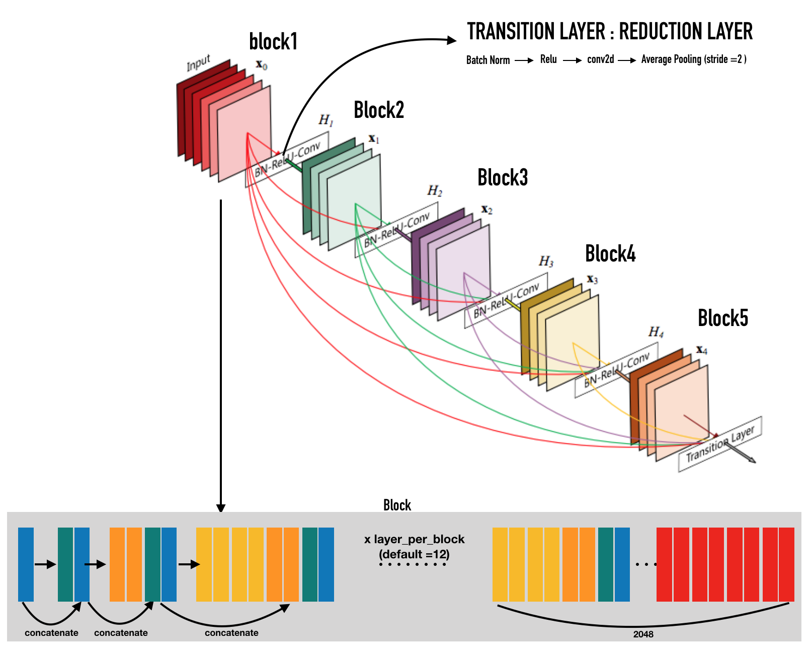
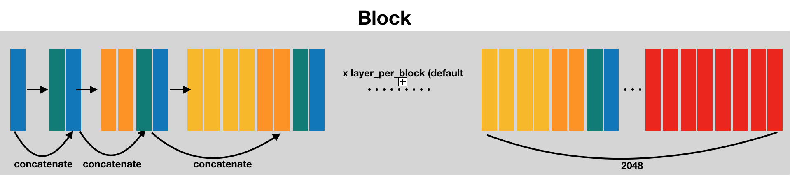

# DenseNet

## abstract 
#### 1.DenseNet connects each layer to every other layer in a feed-forward fashion

#### 2.DenseNet has L(L+1)/2 direct connections

#### 3.For each layer, the feature-maps of all preceding layers are used as inputs, 
#### and its own feature-maps are used as inputs into all subsequent layers.

## advantages:

#### 1.alleviate the vanishing-gradient problem

#### 2.strengthen feature propagation

#### 3.encourage feature reuse

#### 4.substantially reduce the number of parameters

#### 5.requiring less computation to achieve high performance

# Usage
#### train --train
#### test --test 

#### example : python run_this_code.py --train --not_renew_logs 

# Result

